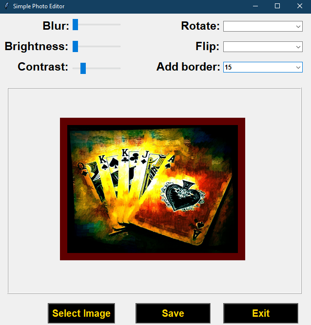
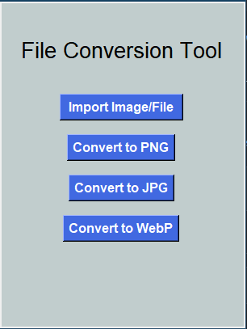
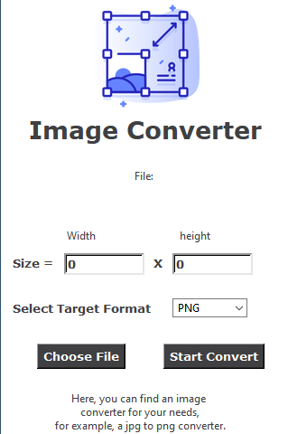
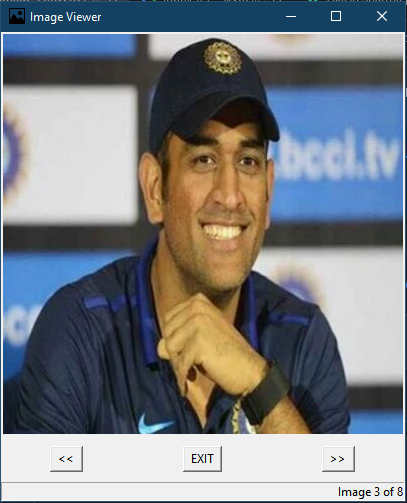

# Image  Editor :

### A smple application to do basic ediitng in your images made using PILLOW.

 

# Image Converter :

### GUI application to convert images to : .jpg, .png & .webp format.

 

# Image Resizer :

### Simple appication to resize images.

 

# Image Viewer :

### Simple application to view images.

